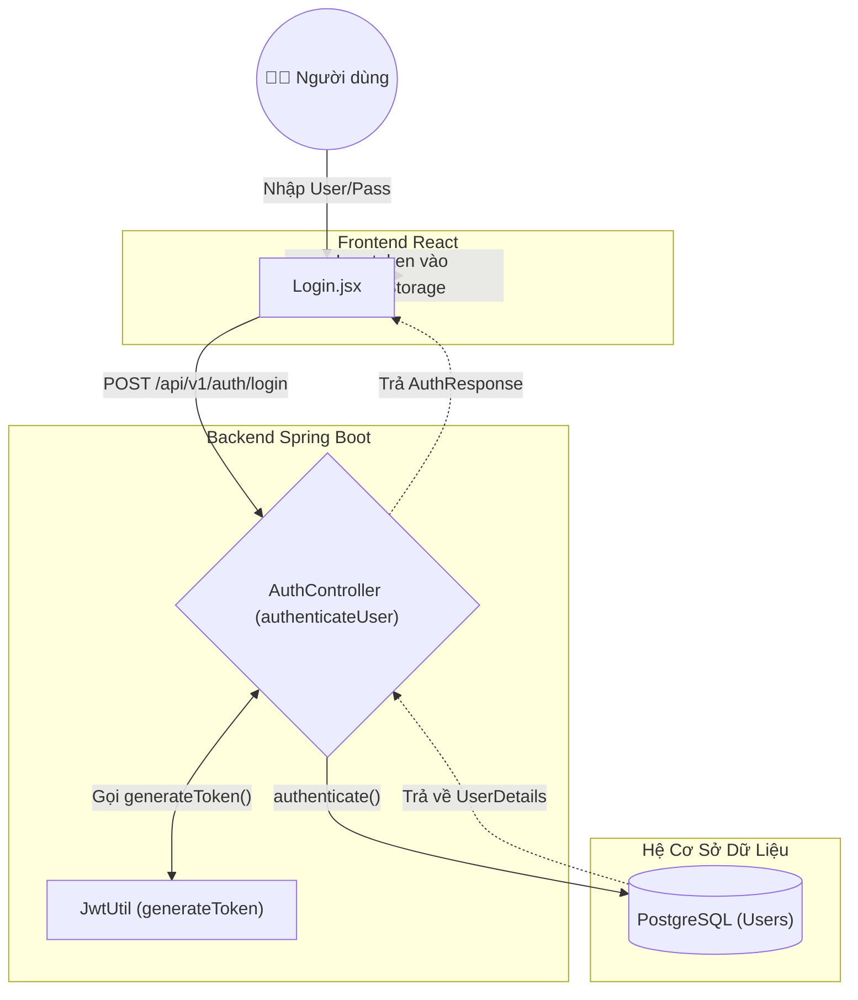
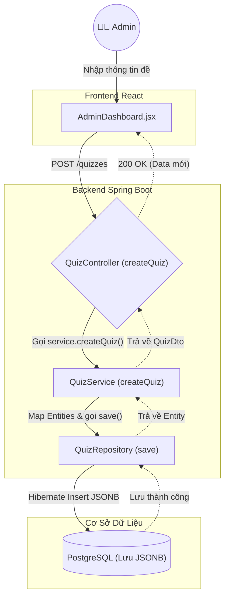
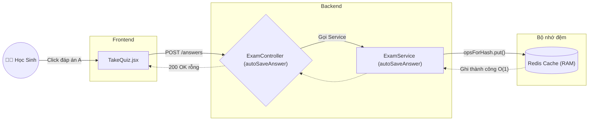
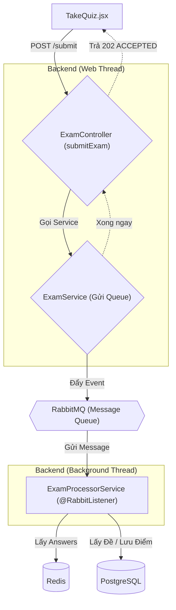
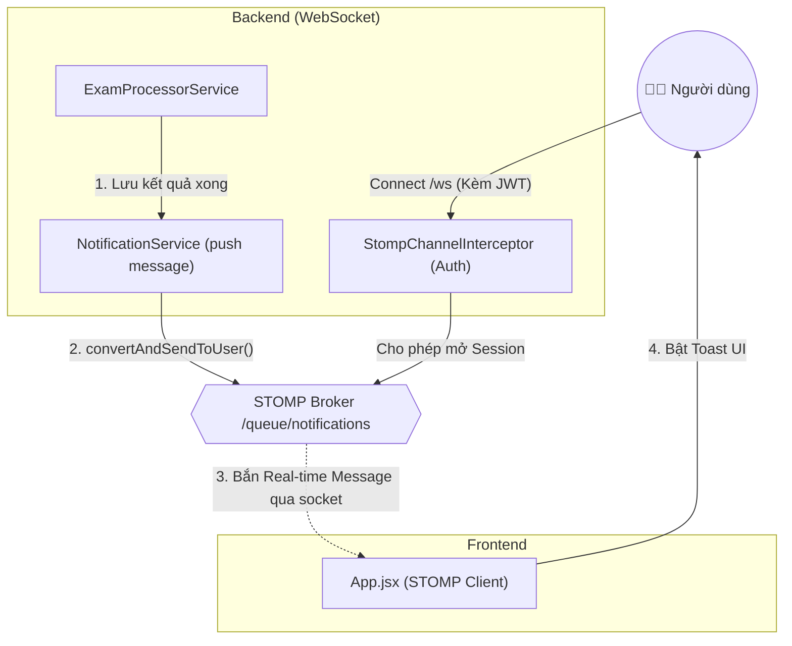

# Luồng Xử Lý & Các Tính Năng Hệ Thống

Tài liệu này trình bày chi tiết các tính năng cốt lõi của Hệ Thống Trắc Nghiệm Hiệu Suất Cao và theo dõi luồng xử lý từ Frontend tới các thành phần Backend với độ chi tiết đến từng function.

## 1. Xác Thực & Phân Quyền Theo Vai Trò (RBAC)
**Mô tả:** Hệ thống sử dụng xác thực JWT (JSON Web Token) không lưu trạng thái (stateless).
**Luồng xử lý cụ thể:**
- **Frontend:** File `Login.jsx` thu thập form data, gọi hàm `fetchApi('/auth/login')`.
- **Backend:**
  - `AuthController.java` (Controller): Chạy hàm `authenticateUser(@RequestBody LoginDto)`.
  - Bên trong Controller, gọi `AuthenticationManager.authenticate()` để kiểm tra tài khoản mật khẩu qua DB.
  - Nếu đúng, Controller gọi tiếp `JwtUtil.java` vào hàm `generateToken(userDetails)` để tạo token.
  - Controller trả về `ResponseEntity.ok(new AuthResponse(token, username, role))` ngược lại cho `Login.jsx`.
  - Từ các request sau: `JwtAuthenticationFilter.java` chạy hàm `doFilterInternal()` chặn request, trích xuất token, gọi `CustomUserDetailsService.loadUserByUsername()` để lấy thông tin từ DB, sau đó cấp quyền truy cập.

## 2. Tạo Bài Thi Hàng Loạt
**Mô tả:** Quản trị viên tạo bài thi với nhiều câu hỏi. Backend dùng JSONB để lưu.
**Luồng xử lý cụ thể:**
- **Frontend:** `AdminDashboard.jsx` gọi hàm `handleCreateQuiz()`, gửi mảng JSON khổng lồ qua `POST /api/v1/quizzes`.
- **Backend:**
  - `QuizController.java` (Controller): Chạy hàm `createQuiz(@RequestBody QuizDto)`.
  - Controller gọi sang `QuizService.java` (Service) tại hàm `createQuiz(QuizDto)`.
  - Tại Service, lặp qua DTO, tạo mới đối tượng `Quiz` và danh sách `Question`. Các lựa chọn (options) được gán thẳng vào thuộc tính `details`.
  - Service gọi `QuizRepository.java` tại hàm `save(quiz)`. Hibernate tự động parse thuộc tính `details` thành JSONB để lưu xuống PostgreSQL.
  - Service trả đối tượng đã lưu ngược lại cho Controller, Controller trả `ResponseEntity.ok(QuizDto)` về cho giao diện báo thành công.

## 3. Lưu Tự Động Siêu Nhanh (In-Memory Cache)
**Mô tả:** Auto-save đáp án vào Redis để tránh sập Database.
**Luồng xử lý cụ thể:**
- **Frontend:** `TakeQuiz.jsx` chạy hàm `handleSelectOption()` khi click đáp án, gọi `POST /exams/{quizId}/questions/{questionId}/answers`.
- **Backend:**
  - `ExamController.java` (Controller): Bắt request tại hàm `autoSaveAnswer()`, trích xuất ID người dùng từ `@AuthenticationPrincipal`.
  - Controller gọi sang `ExamService.java` (Service) tại hàm `autoSaveAnswer(...)`.
  - Service lấy Bean `StringRedisTemplate`, gọi hàm `opsForHash().put(key, questionId, answer)` để ghi đè đáp án vào RAM của Redis.
  - Hoàn thành, Service không trả data gì. Controller trả về `ResponseEntity.ok().build()` (HTTP 200 rỗng) cho Frontend.

## 4. Chấm Điểm Bất Đồng Bộ (RabbitMQ)
**Mô tả:** Nộp bài đẩy vào hàng đợi Message Queue để không block luồng chính.
**Luồng xử lý cụ thể:**
- **Giai đoạn Nộp (Producer):**
  - `ExamController.java` chạy hàm `submitExam(quizId)`.
  - Controller gọi `ExamService.java` chạy hàm `submitExam()`. Service đóng gói data thành `ExamSubmittedEvent`.
  - Service gọi `RabbitTemplate.convertAndSend()` đẩy event vào Queue của RabbitMQ.
  - Service kết thúc liền, Controller trả về `ResponseEntity.accepted().build()` (HTTP 202) cho Frontend `TakeQuiz.jsx`.
- **Giai đoạn Chấm Điểm (Consumer):**
  - `ExamProcessorService.java` (Service background) có gắn `@RabbitListener` tự động nhận message từ Queue.
  - Chạy hàm `processExamSubmission(event)`: 
      1. Gọi `StringRedisTemplate.opsForHash().entries()` lấy toàn bộ đáp án từ Redis.
      2. Gọi `QuizRepository.findWithQuestionsById()` lấy đáp án chuẩn từ DB.
      3. Duyệt mảng so sánh, cộng điểm, gói jsonb `evidence`.
      4. Gọi `ExamResultRepository.save(result)` ghi xuống DB.

## 5. Theo Dõi & Lịch Sử Bài Làm (Admin Review)
**Mô tả:** Admin xem chi tiết bài làm dựa trên lịch sử JSONB đã lưu.
**Luồng xử lý cụ thể:**
- **Frontend:** `AdminDashboard.jsx` gọi `fetchApi('/exams/results')` để lấy danh sách điểm. Khi bấm View Details, gọi tiếp `fetchApi('/quizzes/{id}')`.
- **Backend:**
  - `ExamController.java` chạy hàm `getAllResults()`, gọi `ExamResultRepository.findAll()` lấy dữ liệu thô (gồm cả cột JSONB `evidence` chứa bằng chứng). Trả danh sách `ExamResultDto` về lại UI.
  - `QuizController.java` chạy hàm `getQuiz(id)` để cung cấp đề thi gốc. Frontend kết hợp 2 cục data này để vẽ lại y hệt bài làm của thí sinh, tô đỏ/xanh các câu làm sai/đúng.

## 6. Hệ thống Thông Báo Thời Gian Thực (WebSocket)
**Mô tả:** Báo điểm ngay lập tức thông qua STOMP WebSocket sau khi RabbitMQ xử lý xong.
**Luồng xử lý cụ thể:**
- **Frontend:** `App.jsx` sử dụng `@stomp/stompjs` kết nối qua `ws://.../ws`. Header gửi kèm JWT. Gọi lệnh `client.subscribe('/user/queue/notifications')` để chờ tin.
- **Backend:**
  - Khi kết nối, `StompChannelInterceptor.java` chạy hàm `preSend()`, móc JWT ra, gọi `JwtUtil.validateToken()`, nếu đúng thì gán thông tin vào `accessor.setUser()`.
  - RabbitMQ chạy ngầm xong điểm trong `ExamProcessorService.processExamSubmission()`, nó sẽ gọi `NotificationService.sendNotification(user, message)`.
  - `NotificationService` chạy hàm `sendNotification()`: Lưu thông báo vô `NotificationRepository`, sau đó gọi `SimpMessagingTemplate.convertAndSendToUser()` bắn cục DTO tới user cụ thể.
  - Frontend nhận Message, chạy hàm `toast.success()` bật popup hiển thị báo điểm.

