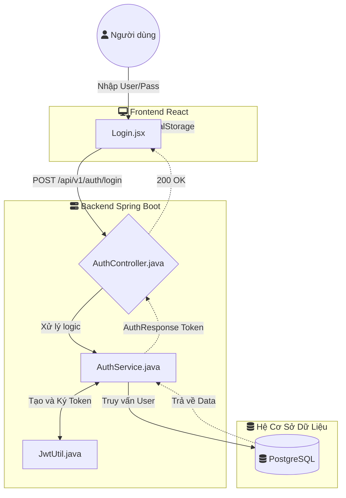
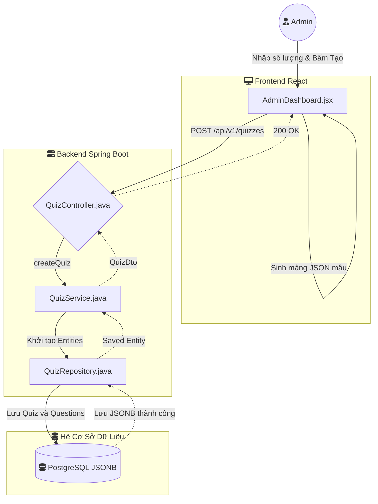
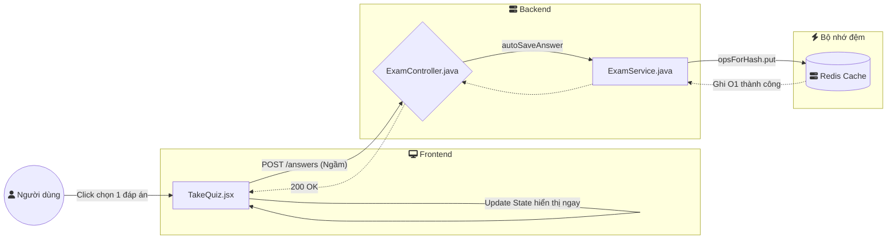
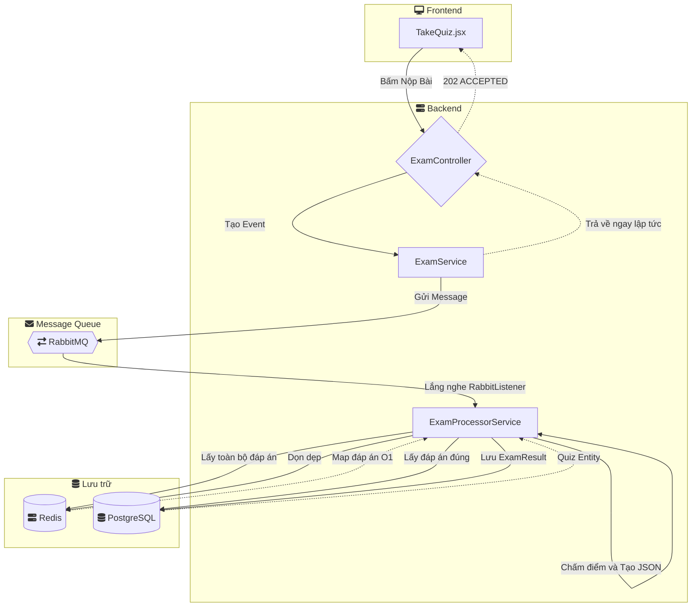
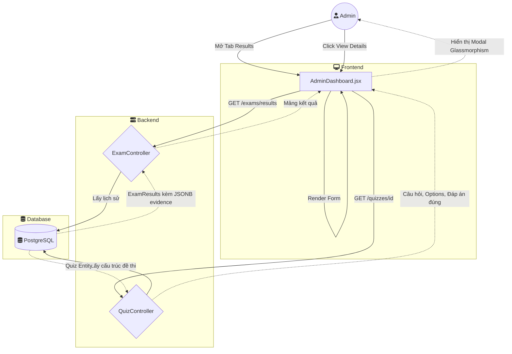

# Luồng Xử Lý & Các Tính Năng Hệ Thống

Tài liệu này trình bày chi tiết các tính năng cốt lõi của Hệ Thống Trắc Nghiệm Hiệu Suất Cao và theo dõi luồng xử lý từ Frontend tới các thành phần Backend.

## 1. Xác Thực & Phân Quyền Theo Vai Trò (RBAC)
**Mô tả:** Hệ thống sử dụng xác thực JWT (JSON Web Token) không lưu trạng thái (stateless). Người dùng có thể đăng ký và đăng nhập. Quản trị viên (Admin) có quyền truy cập vào các trang quản lý, trong khi người dùng bình thường chỉ có quyền làm bài thi.
**Luồng xử lý:**
- **Frontend:**
  - Component: `frontend/src/pages/Login.jsx`
  - Luồng: Người dùng nhập thông tin -> gọi API `fetchApi('/auth/login')` hoặc `/auth/register`.
  - Trạng thái: Khi thành công, lưu `token`, `role` (vai trò), và `username` vào `localStorage` và cập nhật state toàn cục `user` trong `App.jsx`.
- **Backend:**
  - Controller: `AuthController.java` (`/api/v1/auth/login`, `/api/v1/auth/register`)
  - Service: `AuthService.java` (mã hóa mật khẩu, xác minh danh tính).
  - Security/Token: `JwtUtil.java` (tạo mã JWT có hiệu lực 24 giờ).
  - Interceptor: `JwtAuthenticationFilter.java` chặn mọi yêu cầu cần bảo mật, trích xuất JWT và xác thực nó qua `CustomUserDetailsService.java`.

**Sơ đồ luồng:**

## 2. Tạo Bài Thi Hàng Loạt
**Mô tả:** Quản trị viên có thể tạo nhiều bài thi và câu hỏi cùng lúc. Backend tận dụng kiểu dữ liệu JSONB của PostgreSQL để lưu trữ động nhiều câu hỏi và lựa chọn mà không bị giới hạn cứng bởi cấu trúc bảng.
**Luồng xử lý:**
- **Frontend:**
  - Component: `frontend/src/pages/AdminDashboard.jsx` (Tab Quizzes)
  - Luồng: Admin nhập số lượng câu hỏi -> sinh dữ liệu mẫu thành JSON -> gọi `fetchApi('/quizzes')`.
- **Backend:**
  - Controller: `QuizController.java` (`/api/v1/quizzes`)
  - Service: `QuizService.java` (duyệt qua payload, khởi tạo các entity `Quiz` và `Question`).
  - Entity/DB: Trường `details` trong `Question.java` dùng `@JdbcTypeCode(SqlTypes.JSON)` để lưu trữ trực tiếp cấu trúc đáp án và câu hỏi dưới dạng JSONB trong PostgreSQL.
  - Repository: `QuizRepository.java` lưu dữ liệu có cấu trúc lồng nhau này một cách tối ưu.

**Sơ đồ luồng:**

## 3. Lưu Tự Động Siêu Nhanh (Theo thời gian thực)
**Mô tả:** Khi người dùng chọn đáp án trong lúc thi, lựa chọn của họ được lưu lại ngay lập tức. Để tránh tình trạng khóa database và độ trễ cao, tính năng này sử dụng bộ nhớ đệm Redis.
**Luồng xử lý:**
- **Frontend:**
  - Component: `frontend/src/pages/TakeQuiz.jsx`
  - Luồng: User chọn đáp án -> `handleSelectOption` -> gọi `fetchApi('/exams/{quizId}/questions/{questionId}/answers')` bất đồng bộ.
- **Backend:**
  - Controller: `ExamController.java`
  - Service: `ExamService.java` (phương thức `autoSaveAnswer`).
  - Caching (Redis): Đáp án được đẩy ngay lập tức vào Redis Hash bằng `StringRedisTemplate.opsForHash().put(key, questionId, answer)`. Cấu trúc khóa (key) là `exam:{quizId}:user:{userId}`.

**Sơ đồ luồng:**

## 4. Chấm Điểm Bất Đồng Bộ (Dựa trên Sự Kiện)
**Mô tả:** Khi người dùng nộp bài, hệ thống không bắt họ phải chờ quá trình chấm điểm. Nó trả về ngay trạng thái 202 Accepted và đưa tác vụ chấm điểm vào hàng đợi tin nhắn (Message Queue) RabbitMQ để xử lý ngầm.
**Luồng xử lý:**
- **Frontend:**
  - Component: `frontend/src/pages/TakeQuiz.jsx`
  - Luồng: User bấm "Submit" -> gọi `fetchApi('/exams/{quizId}/submit')` -> hiển thị màn hình Thành công.
- **Backend (Producer):**
  - Controller: `ExamController.java`
  - Service: `ExamService.java` (phương thức `submitExam`). Tạo một sự kiện `ExamSubmittedEvent` và gửi nó lên RabbitMQ thông qua `RabbitTemplate.convertAndSend()`.
- **Backend (Consumer):**
  - Service: `ExamProcessorService.java`. Annotation `@RabbitListener` sẽ nhận sự kiện này bất đồng bộ.
  - Luồng: 
    1. Lấy toàn bộ đáp án của user từ Redis Hash với tốc độ O(1).
    2. So sánh đáp án của user với `correctAnswer` trong PostgreSQL.
    3. Tính toán điểm số và map các đáp án đã chọn thành một đối tượng `evidence` (bằng chứng).
    4. Lưu `ExamResult` (bao gồm `evidence` dạng JSONB) xuống Database.
    5. Dọn dẹp cache tạm trong Redis.

**Sơ đồ luồng:**

## 5. Theo Dõi & Lịch Sử Bài Làm (Dành cho Admin)
**Mô tả:** Quản trị viên có thể xem chính xác những đáp án mà người dùng đã chọn để kiểm tra. Phần lịch sử (evidence) được lấy từ cột JSONB và render thành giao diện trực quan.
**Luồng xử lý:**
- **Frontend:**
  - Component: `frontend/src/pages/AdminDashboard.jsx` (Tab Results)
  - Luồng: Lấy danh sách kết quả. Khi bấm "View Details", nó gọi `fetchApi('/quizzes/{id}')` để lấy cấu trúc đề thi gốc, sau đó đắp dữ liệu `evidence` (JSON) lên form giao diện, làm nổi bật các câu đúng/sai.
- **Backend:**
  - Controller: `ExamController.java` (`/api/v1/exams/results`) -> trả về danh sách kết quả kèm JSONB `evidence`.
  - Repository: `ExamResultRepository.java`.

**Sơ đồ luồng:**

