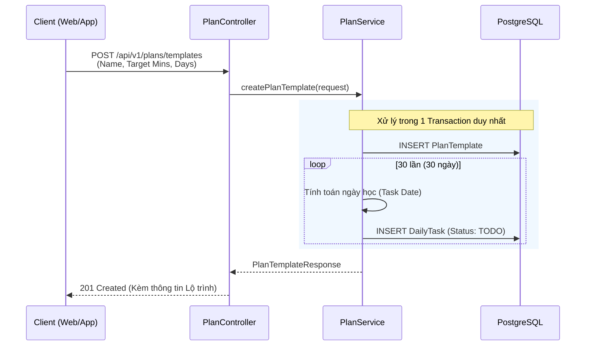
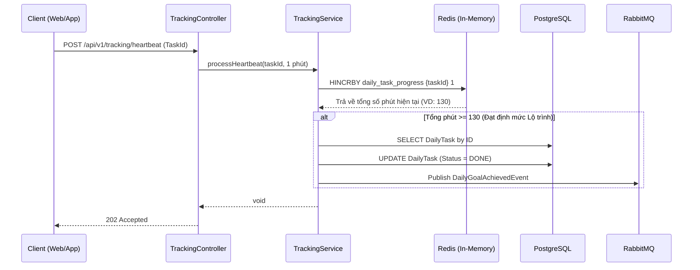
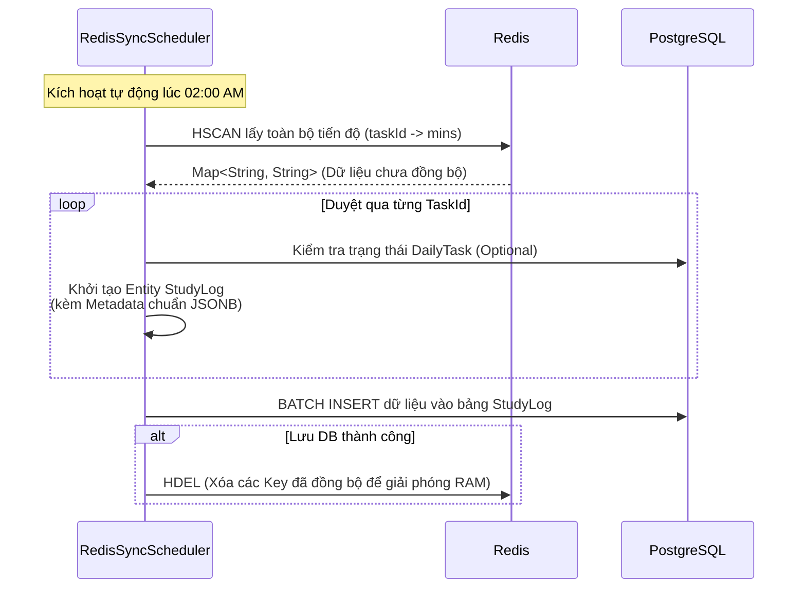

# Sơ đồ Kiến trúc & Luồng xử lý Hệ thống Study Plan Tracker

Dưới đây là các sơ đồ trực quan (Mermaid Diagrams) mô tả chi tiết cách hệ thống giải quyết các bài toán về hiệu năng và logic nghiệp vụ cho từng luồng chức năng (Flow).

## 1. Flow Khởi tạo Lộ trình (Plan Creation Flow)
Luồng này xử lý yêu cầu tạo một lộ trình học tập mới, tự động sinh ra các nhiệm vụ hàng ngày (Daily Tasks) theo khối lượng khổng lồ nhưng vẫn đảm bảo tính toàn vẹn dữ liệu.



## 2. Flow Ghi nhận Heartbeat (High-Throughput Tracking)
Đây là luồng "xương sống" xử lý tải trọng cao. Dữ liệu được ghi liên tục lên thanh RAM (thông qua Redis) thay vì ghi trực tiếp xuống ổ cứng (PostgreSQL) để hệ thống có thể chịu tải hàng chục nghìn người cùng học.



## 3. Flow Xử lý Sự kiện Bất đồng bộ (Event-Driven Notification)
Kiến trúc tách rời (Decoupled). Khi một Task hoàn thành, API không bắt người dùng phải "chờ" Server gửi Email xong mới trả kết quả. Thay vào đó, một Event được ném vào Message Broker (RabbitMQ) và xử lý chạy ngầm độc lập.

```mermaid
flowchart LR
    Publisher(TrackingService) -->|Publish Event| Exchange((Direct Exchange))
    Exchange -->|Routing Key: goal.achieved| Queue[notification.daily_goal.queue]
    Queue -->|Consume Message| Listener(NotificationListener)
    
    subgraph Xử lý Độc lập (Consumer)
        Listener --> Email[Gửi Email chúc mừng]
        Listener --> Push[Đẩy Push Notification]
        Listener --> Log[Ghi Log hệ thống]
    end
```

## 4. Flow Đồng bộ Dữ liệu Ban đêm (Background Sync Job)
Dữ liệu đang nằm rải rác trên RAM (Redis) vào ban ngày sẽ được thu gom và sao lưu vĩnh viễn xuống PostgreSQL vào lúc thấp điểm (2h sáng) để giải phóng bộ nhớ.


